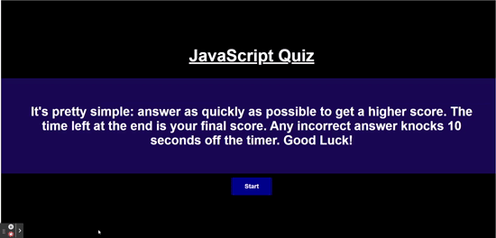

# 04 Web APIs: Code Quiz

## Description

This repo contains a multiple choice quiz game. It uses HTML and CSS which are dynamically updated by JavaScript code written from scratch. It has a clean, polished, and responsive user interface. The user is presented with a series of questions and is given a time limit to answer them. If the user answers a question incorrectly, time is subtracted from the clock. If the user answers all questions correctly or the timer reaches 0, the game is over. The user is then prompted to enter their initials and the game is saved to local storage. The user can then view their score and the high scores.

Here is the link to the page:
https://michaelayers3.github.io/Web-APIs-Code-Quiz/

## Installation

N/A

## Usage

The quiz can be used to help users brush up on basic JavaScript facts. It can also be used to score high scores and challenge one to answer as quickly as possible. 

## Credits

University of Utah
EdX
Jonathan Bejarano

## License

Please refer to the LICENSE in the repo.
